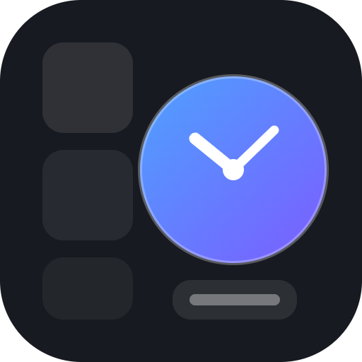

# Linux Dashboard

A customizable dashboard for Linux with two halves:

1. **The editor app** — a desktop app where you design your dashboard: drag
   widgets around, resize them, configure clocks, calendar, notes, to-do,
   system monitor, themes and more.
2. **The real desktop** — a companion GNOME Shell extension that renders your
   widgets **directly on your Linux desktop** (your actual homescreen, behind
   your windows). Edit in the app, and the desktop updates live.

Built with Electron + a GNOME Shell extension. No build step, no external
services, works fully offline.



---

## Requirements

- Linux with GNOME Shell 45+ (tested on GNOME 50 / Ubuntu, Wayland or X11)
- [Node.js](https://nodejs.org) 18+ and npm

## Quick start (the editor app)

```bash
cd ~/Desktop/linux-dashboard
npm install        # first time only (downloads Electron)
npm start          # opens the dashboard editor window
```

## Put the widgets on your real desktop

This is what makes the dashboard part of your machine's homescreen instead of
just an app window:

```bash
npm run extension:install
```

Then **log out and log back in once** (GNOME only scans new extensions at
startup). After you log back in you will see your widgets live on the desktop:

- Clocks, calendar, world clock, system monitor, to-do, notes — rendered
  behind your windows, on the wallpaper itself
- They update live (clocks tick, CPU/memory move every 2 s)
- **Any change you make in the editor app appears on the desktop within a
  second** — the extension watches the same config file

Useful controls:

| Command | What it does |
|---|---|
| `npm run extension:install` | Install the extension + enable desktop mode |
| `npm run extension:enable` / `extension:disable` | Toggle the desktop rendering |
| `npm run extension:uninstall` | Remove the extension |
| **⚙ Settings** in the app | Configure desktop mode: columns, margin, panel opacity, row height |

Notes about desktop mode:

- Widgets are click-through (non-interactive) — the desktop stays usable and
  your desktop icons keep working; editing happens in the app
- Quick Links are app-only (they need clicks)
- If widgets overlap your desktop icons, raise **Screen margin** in the
  Desktop settings or move the icons

## Install the editor as a menu app (optional)

Register it in your application menu with an icon, so you can launch it like any
other installed app (GNOME Activities / app grid, KDE launcher, etc.):

```bash
npm run install:app
```

- Adds **"Linux Dashboard"** to your application menu with an icon
- Launches without a terminal window
- Only one instance can run at a time (launching again focuses the existing window)

### Start automatically at login

Turn the dashboard into a true "homepage" that is always there when you log in:

```bash
npm run install:autostart
```

### Uninstall the menu entry / autostart

```bash
npm run uninstall:app
```

(This removes the launcher, icon and autostart file — your dashboard layout and
data are kept.)

---

## Using the dashboard

When you open the app you are looking at a **live preview of your actual Linux
desktop** — your real wallpaper is shown behind the widgets, and the columns,
margins, spacing and transparency mirror exactly what the desktop renderer
draws. Arrange things here, press **Save**, and the same arrangement appears on
your homescreen behind your windows.

| Action | How |
|---|---|
| **Edit mode** | Always on when the app opens — drag, resize, configure right away. Switch to **Preview Mode** via the segmented control in the header (or `Ctrl+E`) |
| **Save to desktop** | Click **Save Layout** (or `Ctrl+S`) — pushes your layout to the desktop instantly with a confirmation. Changes also autosave ~0.3 s after any edit |
| Add a widget | Click **+ Add Widget** and pick one from the library — it spawns in the first free grid slot |
| Move a widget | **Drag it** — the widget follows your mouse and a dashed preview shows the exact target cells. Release to snap into place |
| Resize a widget | Drag the **bottom-right corner handle** (or right/bottom edges) — snaps to the grid live |
| Nudge a widget | Click to select it, then use **arrow keys** (moves one cell, collision-checked) |
| Lock a widget | Click the **lock icon** in its header (or tick *Lock widget* in settings) — locked widgets can't be dragged/resized and block overlaps |
| Configure a widget | Click the **gear icon** — settings, lock state, width/height |
| Remove a widget | Click the **trash icon** on the widget |
| Cancel an action | **Esc** — cancels an active drag/resize, closes dialogs, clears selection |
| Settings | **Gear icon** in the header — theme, accent color, desktop mode, reset |
| Change theme | Header → **⚙ Settings** → Appearance section |
| Accent color | Header → **⚙ Settings** → Appearance section |
| Reset layout | **⚙ Settings** → Reset layout to defaults |
| Desktop shortcuts | Right sidebar — click any folder to open it in your file manager |
| Fullscreen | `F11` |

### The layout engine

Widgets live on a logical grid (columns set in Desktop settings, default 6).
Every widget stores an explicit position and size:

```json
{ "id": "…", "type": "calendar", "x": 0, "y": 1, "w": 2, "h": 2, "locked": false, "settings": { … } }
```

- **Snapping** — everything aligns to grid cells; no fractional positions
- **Collision handling** — moving/resizing into occupied cells automatically
  pushes neighbors downward; placements blocked by locked widgets show a red
  *Blocked* preview and are rejected
- **No overlap guarantee** — the engine refuses any arrangement where widgets
  would sit on top of each other
- **Persistence** — positions, sizes, lock states and settings all survive
  restarts; older configs (without positions) are migrated automatically
- **Performance** — dragging only moves a lightweight preview; nothing is
  written to disk until you save (or autosave fires)

Everything you edit shows up on your real desktop automatically (within about a
second) — the desktop extension reads the exact same positions. The **Save**
button forces an immediate sync if you want to be sure.

Everything is saved automatically to a local config file — your layout, widget
settings, notes and tasks survive restarts.

## Widgets

| Widget | Description | Settings |
|---|---|---|
| **Digital Clock** | Large numeric clock with date | 12/24-hour, seconds on/off, date on/off, timezone |
| **Analog Clock** | Canvas clock face | timezone, hour numbers, smooth sweeping second hand |
| **World Clock** | Time in several cities at once | add/remove any IANA timezone |
| **Calendar** | Month view, today highlighted, browse months | week starts Sunday or Monday |
| **System Monitor** | Live CPU & memory bars, uptime, hostname | — |
| **To-do List** | Checkable tasks; double-click a task to rename it | — |
| **Sticky Notes** | Free-form scratchpad, autosaved as you type | placeholder text |
| **Quick Links** | Clickable launcher chips for websites (edit mode adds/removes) | — |

Timezones use the standard IANA names (`Asia/Kolkata`, `America/New_York`, …) with
type-ahead suggestions; leave the field as `system` to use your computer's timezone.

## Where your data lives

| File | Purpose |
|---|---|
| `~/.config/linux-dashboard/dashboard-config.json` | **Single source of truth** — layout, widget settings, notes, tasks, theme, desktop mode. Shared by the editor app AND the desktop extension (edits appear on the desktop live) |
| `~/.local/share/gnome-shell/extensions/linux-dashboard@manas/` | The desktop-rendering extension |
| `~/.local/share/applications/linux-dashboard.desktop` | Menu launcher (created by the installer) |
| `~/.config/autostart/linux-dashboard.desktop` | Autostart entry (optional) |

Delete the config file to start fresh (or use the **Reset** button in the app).
If an older copy exists at `~/.config/Linux Dashboard/`, it is migrated here
automatically on first run.

## Troubleshooting

**`npm start` fails with a SUID sandbox error**
This system doesn't have Chrome's setuid sandbox configured. The default
`npm start` already runs with `--no-sandbox` for this reason. If you prefer the
sandboxed mode (requires `chrome-sandbox` owned by root with mode 4755):

```bash
npm run start:sandboxed
```

**Widget shows "Widget error: …"**
Open the gear icon and re-save its settings, or remove and re-add the widget.
If a config file from an older version breaks something, delete
`~/.config/linux-dashboard/dashboard-config.json` and restart.

**Icon/entry not showing in the menu yet**
Log out and back in, or run: `update-desktop-database ~/.local/share/applications`

## Project structure

```
linux-dashboard/
├── main.js                  Electron main process (window, IPC: config, stats, wallpaper, window controls, sidebar dirs)
├── preload.js               Secure bridge exposing window.dashboard to the UI
├── package.json             Scripts: start, install:app, extension:*, etc.
├── CHANGELOG.md             Full feature/implementation history
├── assets/                  App icon (SVG + PNG)
├── extension/               GNOME Shell extension (renders widgets on the real desktop)
│   ├── metadata.json
│   ├── extension.js         Reads the shared config, draws widgets at stored positions
│   └── stylesheet.css
├── scripts/
│   ├── install-desktop.sh   Menu entry / autostart / uninstall
│   ├── install-extension.sh Desktop extension install / uninstall
│   └── extension-toggle.js  Enable/disable via gsettings
└── src/
    ├── index.html           App shell (header, canvas viewport, sidebar, drawer, modal)
    ├── style.css            Glassmorphic themes, layout regions, widget cards, responsive
    └── js/
        ├── app.js           State, grid editor (drag/resize/lock), settings modal, sidebar, persistence
        ├── layout.js        Layout engine: placement, snapping, collisions, free slots
        ├── widgets.js       Widget registry (combines the two files below)
        ├── widgets-clocks.js Analog / digital / world clock (redesigned faces)
        ├── widgets-tools.js  Calendar, system monitor (sparkline), to-do (priorities), notes, quick links
        └── icons.js         Inline SVG icons (grip, lock, gear, trash, globe, etc.)
```

### Adding your own widget

Add an entry to `src/js/widgets-tools.js` (or `widgets-clocks.js`):

```js
myWidget: {
  name: 'My Widget',
  desc: 'What it does',
  defaultSize: { w: 2, h: 1 },
  defaults: { someSetting: true },
  settings: [{ key: 'someSetting', label: 'Some setting', type: 'bool' }],
  mount(body, item, api) {
    body.textContent = 'Hello';
  }
}
```

`mount` builds the widget DOM and may return a cleanup function (to clear timers).
Supported setting field types: `bool`, `select`, `text`, `number`, `tz`, `zonelist`.
It appears in the widget library automatically.

To also show it on the real desktop, add a builder to the `BUILDERS` map in
`extension/extension.js` (uses St/Clutter instead of DOM) and re-run
`npm run extension:install`.

## Troubleshooting (desktop extension)

**Widgets don't appear after install**
You must log out and back in once so GNOME scans the new extension. Then check:

```bash
gnome-extensions info linux-dashboard@manas   # should say Enabled: true
journalctl --user -b | grep linux-dashboard   # shows render status/errors
```

If `info` says it doesn't exist, the relogin hasn't happened yet. If it says
`Enabled: false`, run `npm run extension:enable`. Also make sure desktop mode
is on (the **Desktop** button in the app is highlighted when enabled).

**Widgets disappeared**
They hide automatically if the config file is missing, desktop mode is off, or
the layout is empty. Open the app and check the **Desktop** button.

**Version mismatch error in GNOME Extensions app**
`scripts/install-extension.sh` auto-adds your detected GNOME version to
`metadata.json`. If you upgraded GNOME since installing, re-run
`npm run extension:install`.

## Debug tip

Render a screenshot of the dashboard without looking at the screen:

```bash
DASH_SHOT=/tmp/dash.png npm start
```
